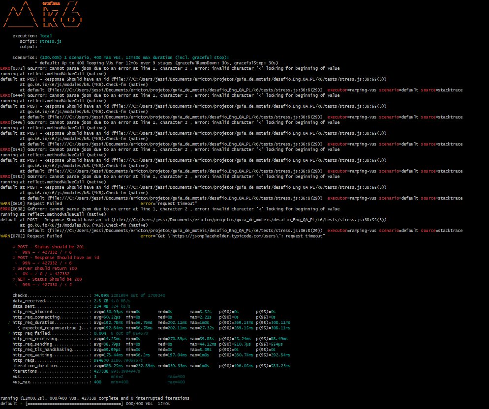

# Teste de Stress 

### Descrição  
- Cenário com 400 usuários simultâneos (VUs) durante 1 minuto e 30 segundos.
- O objetivo era identificar o limite da aplicação sob alto volume de acessos

### Passos para Reproduzir  
1. Acesse a API REST **[JSONPLACEHOLDER](https://jsonplaceholder.typicode.com/users)**.  
2. Requisição **POST**  
2. Requisição **GET**  

### Resultado Esperado  
- A API tem que responder ao requesitos solicitados com sucesso  

### Resultado Atual  
- Taxa de Sucesso: Apenas 74.99% dos checks foram bem-sucedidos (427.732 de 570.346 requisições).
- http_req_duration: 259.15 ms (média), com máximo de 602 ms e p90 = 367 ms.
- Falhas: Houve erros de requisição (http_req_failed: 0.01%), além de mensagens de erro indicando timeouts e erros de parsing.
- Erros de Status Code: Muitos erros de status 500 foram observados, indicando que o sistema falhou ao processar adequadamente requisições sob alta carga.
- O API enfrentou problemas significativos sob stress, com tempo de resposta mais alto (259 ms em média) e vários erros de status code 500. Isso mostra que o sistema não está totalmente preparado para lidar com picos extremos de usuários.
  
### Ambiente de Teste  
- **Dispositivos**: Notebook (GitBash)  
- **Sistema Operacional**: Windows 11

### Evidência  

