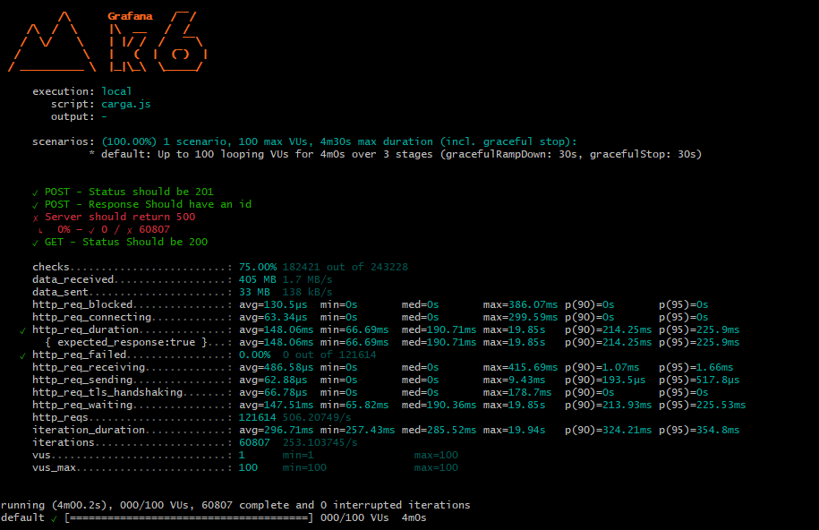

# Teste de Carga 

### Descrição  
- Cenário com 100 usuários simultâneos (VUs) executando requisições por 4 minutos.
- Inclui ramp-up e ramp-down de 30 segundos.

### Passos para Reproduzir  
1. Acesse a API REST **[JSONPLACEHOLDER](https://jsonplaceholder.typicode.com/users)**.  
2. Requisição **POST**  
2. Requisição **GET**  

### Resultado Esperado  
- A API tem que responder ao requesitos solicitados com sucesso  

### Resultado Atual  
- Taxa de Sucesso: 75% dos checks foram bem-sucedidos (182.421 de 243.228 requisições).
- http_req_duration: 148.06 ms (média), com máximo de 386 ms e p90 = 214.25 ms.
- Falhas: Nenhum erro de requisição foi registrado (http_req_failed: 0%).
- Erros de Status Code: 25% das requisições não passaram nos checks esperados (500 erros ou dados inesperados).
- O API conseguiu lidar com 100 usuários simultâneos de forma consistente, mas ainda apresentou 25% de falhas nos checks esperados. O tempo médio de resposta foi adequado para um ambiente de carga, mas os erros indicam que o sistema pode precisar de ajustes para melhorar sua confiabilidade sob carga.
  
### Ambiente de Teste  
- **Dispositivos**: Notebook (GitBash)  
- **Sistema Operacional**: Windows 11

### Evidência  

