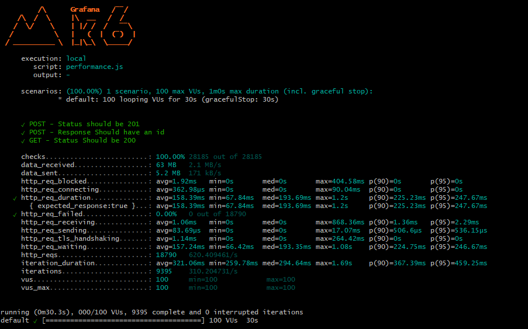

# Teste de Performance 

### Descrição  
- Cenário com 100 usuários simultâneos executando requisições por 1 minuto..  

### Passos para Reproduzir  
1. Acesse a API REST **[JSONPLACEHOLDER](https://jsonplaceholder.typicode.com/users)**.  
2. Requisição **POST**  
2. Requisição **GET**  

### Resultado Esperado  
- A API tem que responder ao requesitos solicitados com sucesso

### Resultado Atual  
- Taxa de Sucesso: 100% dos checks foram bem-sucedidos (28.185 requisições).
- http_req_duration: 158.39 ms (média), com máximo de 404 ms e p90 = 225.23 ms.
- Falhas: Nenhum erro de requisição foi registrado (http_req_failed: 0%).
- A API demonstrou bom desempenho com 100 usuários simultâneos em um cenário controlado, sem falhas ou erros. O tempo médio de resposta foi consistente e dentro do esperado, com 100% de sucesso nos checks.  
### Ambiente de Teste  
- **Dispositivos**: Notebook (GitBash)  
- **Sistema Operacional**: Windows 11

### Evidência  

